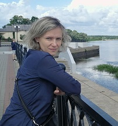

# Tatsiana Yatskova     

## Contacs:
- Phone: +375256409181 Life, Viber
- Marital status: Marrie
- Date of birth: 30 August 1981
- Discord: Tatsiana#4268
- E-mail: YatskovaTN@gmail.com

## About myself:
14 years experience in IT. Development and maintenance of software for the needs of the enterprise, consultation and technical support for users
## Skills:
SQL query language, database administration, web development, programming languages ​​VFP, C#, work with MS SQL Server, Maria DB, Delphi

## Code example:
```
function Get-PSRemove ($day,$file_) # удаляем файлы меньше заданной даты  
{  
	# считаем кол-во файлов
	$count = Get-ChildItem $Target_FSF -File -filter $file_ | Measure-Object | ForEach-Object{ $_.Count }
	# массив файлов по условию, сортируем по убыванию
	$table = Get-ChildItem $Target_FSF -Filter $file_ | Sort-Object -Descending $_.BaseName
	if ($count -gt 0)
	{ echo $table >> $logProgress}
	else
	{  Cmd.exe /c echo $Target_FSF  >> $logProgress }
	Cmd.exe /c echo Кол-во файлов $file_ $count  >> $logProgress
	if ($count -ge $day) #больше или равно удаляем bak и чистим папки с trn
	{
		$ChDaysDel = $table[$day - 2].LastWriteTime
		Cmd.exe /c echo Удаляем файлы, дата создания которых меньше $ChDaysDel.Tostring('dd\.MM\.yyyy hh\:mm')  >> $logProgress
		# Удаление файлов, дата создания которых меньше заданной даты
		Get-ChildItem -Path $Target_FSF | Where-Object { $_.LastWriteTime -LT $ChDaysDel } | Select-Object Name,LastWriteTime >> $logProgress #выведем список файлов, которые будем удалять
		Get-ChildItem -Path $Target_FSF | Where-Object { $_.LastWriteTime -LT $ChDaysDel } | Remove-Item -Recurse -Force 
	}
	else
	{
		Cmd.exe /c echo Нет файлов для удаления  >> $logProgress
	}
}
$DB=""  
foreach ($DB in $dir_DB) # 2 BAK
{
		$Folder=""
	foreach ($Folder in $dir_2_bak)
	{
		$Target_FSF = $Target_FS+$DB+ "\SQLDataBase\" + $Folder + "\"		
		$count = 0
		if (Test-Path $Target_FSF)
		{
			Get-PSRemove -day 3 $file_
		}
	}
}
```
##  Education and courses:
 Name                             |  Year
:------------------------------------------|:-------------:
[Udemy - webdeveloper](https://www.udemy.com/course/webdeveloper/)|2022
[It=academy - "Fundamentals of web technologies" (remotely)](https://www.dist.it-academy.by/)|2021
Department ASIP qualification Engineer Information Technology| 2008 - 2015
Gomel State Engineering College, qualification "Technician-programmer"|1996 - 2000

## Language:
English level - A1